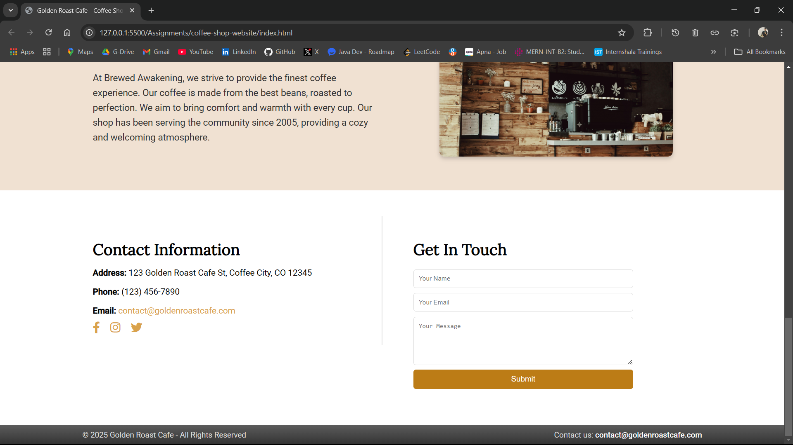

# Brewed Awakening - Coffee Shop Website ☕

A beautifully designed and fully responsive Coffee Shop website built using HTML, CSS, and modern UI techniques.

## Table of Contents
- [About the Project](#about-the-project)
- [Features](#features)
- [Technologies Used](#technologies-used)
- [UI & Styling](#ui--styling)
- [Folder Structure](#folder-structure)
- [Installation & Usage](#installation--usage)
- [Responsive Design](#responsive-design)
- [Screenshots](#screenshots)
- [Contributing](#contributing)
- [License](#license)
- [Contact](#contact)

## About the Project
Brewed Awakening is a modern, elegant, and user-friendly coffee shop website. It provides a seamless and interactive experience for customers to explore the menu, learn about the brand, and get in touch with the coffee shop.

This website is fully responsive, designed with a warm and inviting coffee-themed UI, ensuring a delightful browsing experience across all devices.

## Features
- Interactive Navigation Bar – Smooth scrolling and responsive menu items  
- Hero Section – Engaging introduction with a call-to-action button  
- Dynamic Menu Section – Coffee and breakfast items displayed in a professional card layout  
- About Us Section – Beautifully designed section with a shop image and description  
- Contact Us Section – Includes a contact form and business details (phone, email, address)  
- Social Media Links – Clickable social icons for better connectivity  
- Fully Responsive – Optimized for desktop, tablet, and mobile screens  
- Smooth Hover Effects – Buttons and links have elegant hover animations  

## Technologies Used
| Technology | Description |
|------------|-------------|
| HTML5 | Markup structure for the website |
| CSS3 | Styling and layout with Flexbox & Grid |
| Font Awesome | Icons for social media & UI elements |
| Google Fonts | Custom fonts for a professional look |
| Responsive Design | Mobile-first approach with media queries |

## UI & Styling
- **Typography:** Uses warm, professional fonts like Roboto and Lora.  
- **Color Palette:** Coffee-inspired shades of brown, cream, and golden yellow.  
- **Hover Effects:** Smooth transitions for buttons, links, and menu items.  
- **Box Shadows & Border Radius:** Adds depth and a modern feel.  

## Folder Structure
```
BrewedAwakening/
│── assets/           # Images and icons  
│── index.html        # Main HTML file  
│── styles.css        # Main CSS file  
│── README.md         # Project documentation  
│── favicon.ico       # Website icon  
```

## Installation & Usage
### Run Locally
1. Clone the Repository:
```sh
git clone https://github.com/yourusername/BrewedAwakening.git
```
2. Navigate into the Project Folder:
```sh
cd BrewedAwakening
```
3. Open the `index.html` File in Any Browser:
```sh
start index.html  # Windows  
open index.html   # macOS  
xdg-open index.html  # Linux  
```
4. Enjoy Browsing! 🎉

## Responsive Design
| Device | Preview |
|--------|---------|
| **Desktop 💻** | Fully optimized for large screens |
| **Tablet 📱** | Adjusts layout for medium screens |
| **Mobile 📲** | Mobile-friendly interface |

Tested on: Chrome, Firefox, Edge, Safari, and Opera.

## 📷 Screenshots
### 🔹 Home Page


### 🔹 Menu Listing


### 🔹 About


### 🔹 Contact Section


---
## Contributing
Want to contribute? Follow these steps:

1. **Fork the repository**
2. **Create a new feature branch**
   ```sh
   git checkout -b feature-branch
   ```
3. **Make your changes and commit**
   ```sh
   git commit -m "Added a new feature"
   ```
4. **Push to GitHub**
   ```sh
   git push origin feature-branch
   ```
5. **Open a pull request**

### Issues & Feedback
If you find a bug or have a feature request, please open an issue!

## License
This project is licensed under the **MIT License** – feel free to use and modify!

## 👨‍💻 Created By
**Tejas Govind Ambore**
- Full Stack Developer Intern at **Innomatics Research Labs**
- LinkedIn: [Tejas Ambore](https://www.linkedin.com/in/tejasambore)
- GitHub: [Tejas Ambore](https://github.com/tejasambore)

---

Follow us on Social Media!
