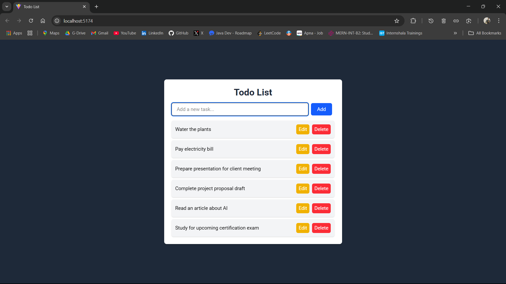
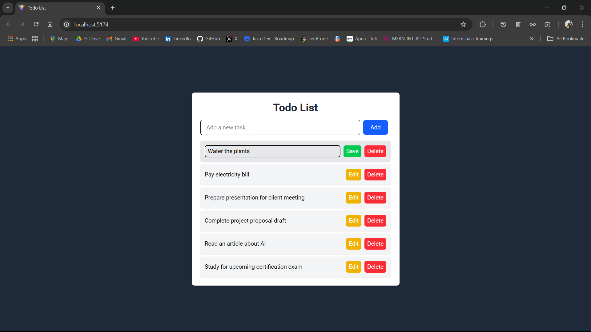

---

# **📌 Interactive Todo List Application (React + Tailwind)**
**🚀 Internship Assignment #5 - Innomatics Research Labs | Full-Stack Developer Intern**

### **🔹 Overview**
This project is a **modern, interactive, and user-friendly** **Todo List Application** built with **React (Vite) and Tailwind CSS**. The application allows users to **add, edit, complete, and delete tasks** efficiently while providing a sleek and professional UI.  

✨ **Why this project?**  
- Aimed at enhancing **frontend development skills**.  
- Focused on **state management, interactivity, and user experience**.  
- Utilizes **modern UI frameworks** (React + Tailwind).  
- Implements **best coding practices** in React.  

---

## **📌 Features**
✅ **Add Tasks** - Users can add new tasks with ease.  
✅ **Edit Tasks** - Modify existing tasks with a smooth inline editing feature.  
✅ **Mark as Completed** - Click to toggle task completion, applying a strikethrough effect.  
✅ **Delete Tasks** - Remove tasks with a single click.  
✅ **Responsive UI** - Works flawlessly across all devices.  
✅ **Dark Mode Support** (Optional) - Improve usability in different environments.  
✅ **Smooth Animations** - Enhance user experience with CSS transitions.  

---

## **🚀 Tech Stack**
- **Frontend**: React (Vite), Tailwind CSS  
- **State Management**: React Hooks (`useState`)  
- **Styling**: Tailwind CSS (utility-first approach)  
- **Deployment**: Netlify  

---

## **🛠️ Installation & Setup**
Follow these steps to run the project locally:

### **1️⃣ Clone the Repository**
```bash
git clone https://github.com/tejasambore/fullStackInternshipInnomatics.git
cd Assignments/todo-app
```

### **2️⃣ Install Dependencies**
```bash
npm install
```

### **3️⃣ Run the Development Server**
```bash
npm run dev
```
✅ Open `http://localhost:5173` in your browser to view the app.

---

## **📁 Project Structure**
```
/todo-app
  ├── /src
  │   ├── /components
  │   │   ├── AddTodo.jsx       # Component to add a new task
  │   │   ├── TodoList.jsx      # Component to display the list of tasks
  │   │   ├── TodoItem.jsx      # Individual task component with edit & delete options
  │   ├── App.jsx               # Main application logic & state management
  │   ├── main.jsx              # Entry point
  ├── index.css                 # Tailwind CSS imports
  ├── tailwind.config.js        # Tailwind configuration
  ├── package.json              # Project dependencies
  ├── README.md                 # Documentation
```

---

## **🎨 UI Design**
This app is built with **Tailwind CSS**, offering:
✅ **A modern, professional design**  
✅ **Responsive layout** (Mobile-friendly)  
✅ **Intuitive user interactions**  
✅ **Smooth animations for task actions**  

---

## **🖼️ Screenshots**
| Task View | Edit Mode | Completed Task |
|-----------|----------|---------------|
|  |  |  |

---

## **💡 Future Enhancements**
🔹 **Dark Mode Support**  
🔹 **Drag & Drop Sorting** using `react-beautiful-dnd`  
🔹 **Local Storage Persistence**  
🔹 **Priority-based Task Management**  

---

## **📜 License**
This project is licensed under the **MIT License**.

---

## **🤝 Contributing**
Want to improve this project?  
🔹 Fork this repository  
🔹 Create a new feature branch (`git checkout -b feature-name`)  
🔹 Commit your changes (`git commit -m "Added a feature"`)  
🔹 Push the branch (`git push origin feature-name`)  
🔹 Open a **Pull Request**  

We appreciate your contributions! 🚀

---

## **📞 Contact**
💡 **Author**: Tejas Ambore  
📩 **Email**: tejasambore2003@gmail.com  
🌐 **LinkedIn**: [Tejas Ambore](https://linkedin.com/in/tejasambore)  
📂 **GitHub**: [TejasAmbore](https://github.com/tejasambore)  

---

### **🌟 Show Some Love**
If you like this project, don't forget to **star ⭐ the repository**! 🚀🎯  

---
