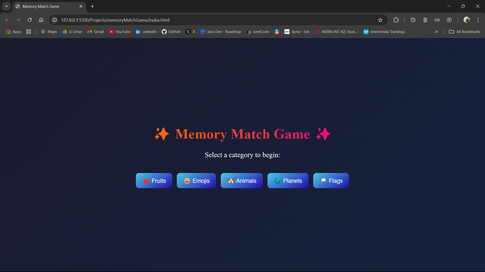
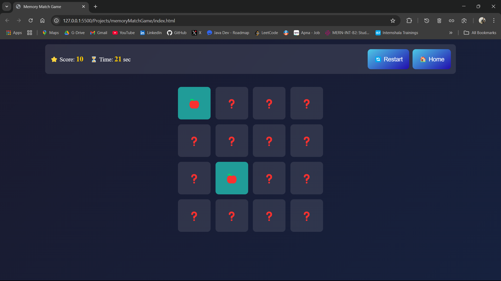

Here’s the **final polished `README.md`** with a **"Created By"** section added at the end.  

---

# 🧠 **Memory Match Game** 🎮  

> A captivating **Memory Match Game** with a futuristic **dark mode UI**, **randomized color themes**, and **smooth animations**—built with **HTML, CSS, and JavaScript**. Test your memory skills across multiple categories before time runs out!  

  

---

## 🌟 **Key Features**  
✅ **Dark Mode & Neon Glow** – Aesthetic design with a futuristic touch  
✅ **Randomized Color Themes** – Unique UI for every session  
✅ **Multiple Categories** – Fruits 🍎, Emojis 😃, Animals 🐶, Planets 🌍, Flags 🏳️  
✅ **Dynamic Gameplay** – Flip, match, and race against time  
✅ **Inline Score & Timer** – Displayed together for better UX  
✅ **Smooth Animations** – Engaging card flips & transitions  
✅ **Fully Responsive** – Optimized for **desktop, tablet, and mobile**  

---

## 🎮 **How to Play?**  
1️⃣ **Select a Category** – Choose **Fruits, Emojis, Animals, Planets, or Flags**  
2️⃣ **Flip the Cards** – Click on a card to reveal its hidden symbol  
3️⃣ **Find Matching Pairs** – Match two cards to keep them flipped  
4️⃣ **Win Before Time Runs Out** – You have **30 seconds** to match all pairs  
5️⃣ **Restart or Go Home** – Use the buttons to restart or return to the main menu  

🚀 **Challenge Yourself!** – Can you beat the game before time runs out?  

---

## 📸 **Screenshots**  

| Landing Page | Game Screen |
|-------------|------------|
|  |  |

---

## 🛠️ **Tech Stack**  
🔹 **HTML5** – Structure & markup  
🔹 **CSS3** – Styling with animations & dark mode  
🔹 **JavaScript (ES6+)** – Game logic & interactivity  

---

## 📂 **Project Structure**  
```
📦 Memory Match Game
│── 📂 assets/         # Folder for images/screenshots
│       │── landing.png     # Landing page Screenshot
│       │── game.png        # Game page Screenshot
│── 📜 index.html           # Main HTML file
│── 📜 styles.css           # CSS file for styling
│── 📜 script.js              # JavaScript file for game logic
│── 📜 README.md     # Documentation file
```

---

## 🚀 **Installation & Setup**  
1️⃣ **Clone this repository**  
```sh
git clone https://github.com/your-username/memory-match-game.git
```
2️⃣ **Navigate into the project folder**  
```sh
cd memory-match-game
```
3️⃣ **Open `index.html` in your browser**  
```sh
open index.html   # Mac
start index.html  # Windows
```
📌 **No additional dependencies required!** Just open and play.  

---

## 🎯 **Upcoming Enhancements**  
✨ **Sound Effects** – Add sound feedback for flipping & matching cards  
✨ **Save Game State** – Allow players to resume from where they left off  
✨ **Leaderboards** – Store high scores for competition  
✨ **More Categories** – Expand with new themes (Pokémon, Superheroes, etc.)  

---

## 📜 **License**  
This project is **open-source** and available under the **MIT License**.  

---

## 👨‍💻 **Created By**  
🚀 **Tejas Govind Ambore**  ❤️
🔗 [LinkedIn](https://www.linkedin.com/in/tejas-ambore) 
🔗 [GitHub](https://github.com/Tejas-Ambore) 
🔗 [Portfolio](#)  

---
