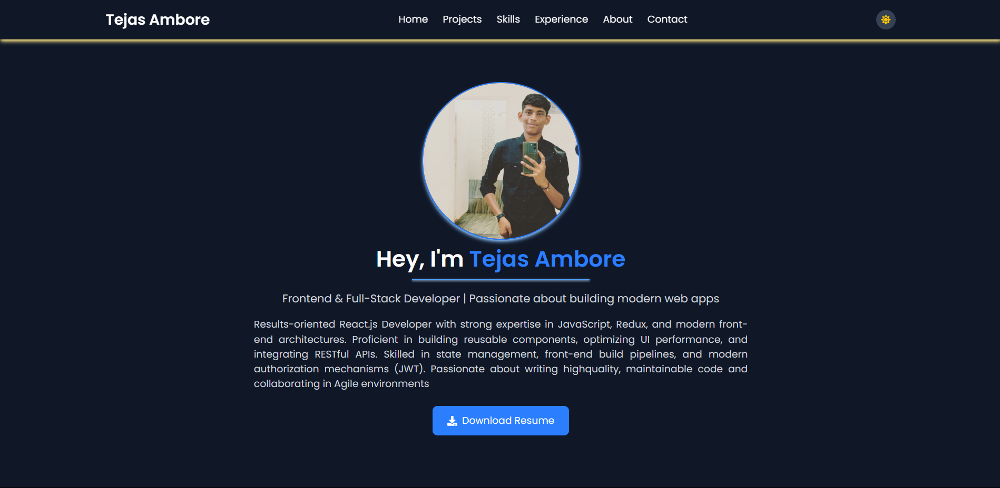
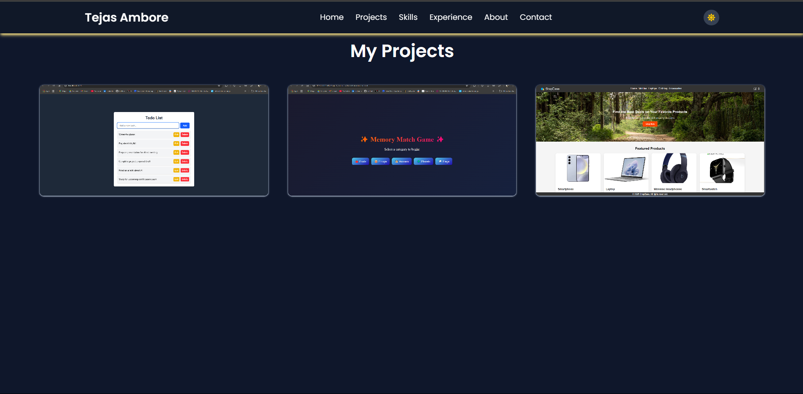
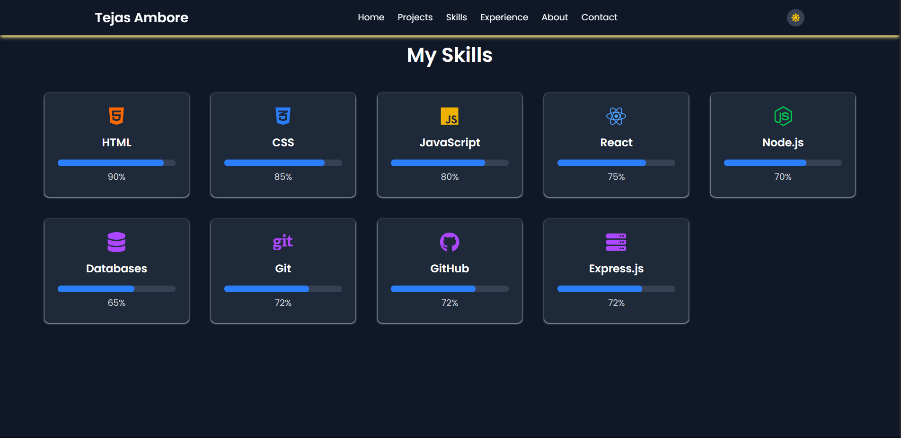
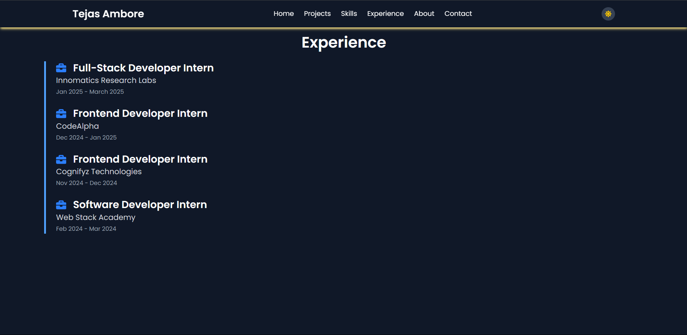
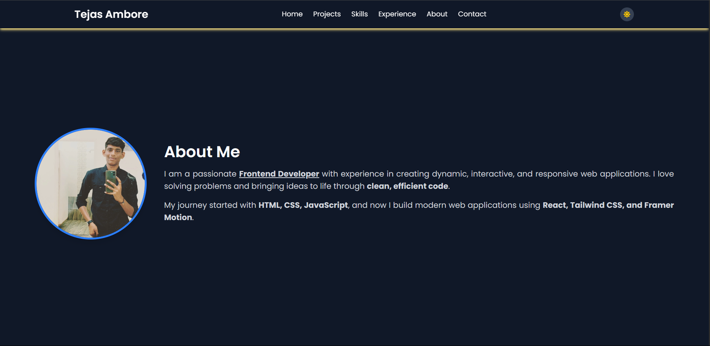
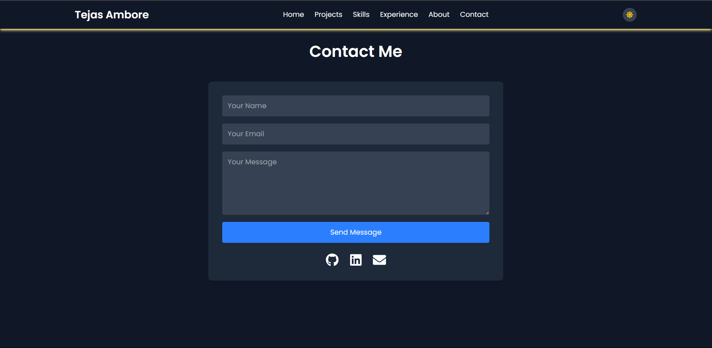

# Personal Portfolio Website
Welcome to my personal portfolio website repository! This repository contains the source code for my personal portfolio website, showcasing my skills, projects, and experiences. The website is built using React.js and Tailwind CSS, and it's designed to be fully responsive and optimized for performance.
---

# 🚀 **Personal Portfolio Website**  

### 🌐 **Live Demo**: [tejasambore.netlify.app](https://tejasambore.netlify.app)  

### **Home**:
  

### **Project**:
  

### **Skill**:
  

### **Experience**:
  

### **About**:
  

### **Contact**:
  

---

## 📌 **About Me**  

Hello! I'm **Tejas Ambore**, a passionate **Frontend & Full-Stack Developer** with expertise in building modern and responsive web applications. I love crafting intuitive user experiences and bringing ideas to life with cutting-edge web technologies.  

🔹 **Skills**: React.js, JavaScript, Tailwind CSS, Node.js, Express, MongoDB  
🔹 **Interests**: Web Development, UI/UX Design, Open Source Contributions  
🔹 **Connect with Me**:  
[](https://linkedin.com/in/tejasambore)  
[](https://github.com/tejasambore)  

---

## 🎯 **Project Overview**  

This **Personal Portfolio Website** showcases my projects, skills, and professional journey. It is designed to be fully responsive, visually appealing, and optimized for performance.  

### ✨ **Features**  
✔️ **Home** – A dynamic introduction with a professional photo  
✔️ **About Me** – My background, education, and experience  
✔️ **Skills** – Tech stack with progress visualization  
✔️ **Projects** – Showcasing my best work with live links & GitHub repos  
✔️ **Experience** – Highlighting internships and work experience  
✔️ **Contact** – A contact form with social media links  
✔️ **Dark Mode** – User-friendly theme toggle  
✔️ **Blog** – A section to share insights and knowledge  
✔️ **Resume Download** – Quick access to my latest resume  

---

## 🛠 **Tech Stack**  

| **Category**  | **Technology Used**  |
|--------------|---------------------|
| **Frontend**  | React.js (Vite), Tailwind CSS, Framer Motion  |
| **State Management**  | React Hooks (useState, useEffect)  |
| **Animations**  | Framer Motion  |
| **Backend (if applicable)**  | Node.js, Express.js  |
| **Form Handling**  | EmailJS (for contact form submissions)  |
| **Deployment**  | Netlify / Vercel  |

---

## 📂 **Project Structure**  
```
/portfolio
 ├── /public
 │   ├── resume.pdf
 │   ├── favicon.ico
 ├── /src
 │   ├── /assets
 │   │   ├── project
 │   │   │   ├── memory-match-game,png
 │   │   │   ├── shopping-cart,png
 │   │   │   ├── todo-app,png
 │   │   ├── resume
 │   │   │   ├── Tejas_Ambore_Resume.pdf
 │   │   ├── profile_pic.jpg
 │   ├── /components
 │   │   ├── AboutSection.jsx
 │   │   ├── ContactSection.jsx
 │   │   ├── DarkModeToggle.jsx
 │   │   ├── EducationSection.jsx
 │   │   ├── ExperienceSection.jsx
 │   │   ├── HomeSection.jsx
 │   │   ├── Navbar.jsx
 │   │   ├── ProjectSection.jsx
 │   │   ├── SkillsSection.jsx
 │   ├── /pages
 │   │   ├── About.jsx
 │   │   ├── Contact.jsx
 │   │   ├── Experience.jsx
 │   │   ├── Home.jsx
 │   │   ├── Projects.jsx
 │   │   ├── Skills.jsx
 │   ├── App.jsx
 │   ├── index.css
 │   ├── main.jsx
 ├── tailwind.config.js
 ├── vite.config.js
 ├── README.md
 ├── package.json
 └── .gitignore
```

---

## 🚀 **Installation & Setup**  

1️⃣ **Clone the repository**  
```bash
git clone https://github.com/tejasambore/fullStackInternshipInnomatics.git
cd /Projects/personal-portfolio
```

2️⃣ **Install dependencies**  
```bash
npm install
```

3️⃣ **Run the development server**  
```bash
npm run dev
```

4️⃣ **Build for production**  
```bash
npm run build
```

5️⃣ **Deploy on Netlify/Vercel** *(optional)*  
```bash
# If deploying on Vercel
vercel deploy

# If deploying on Netlify
netlify deploy
```

---

## 🎨 **Customization**  
- Update `resume.pdf` in the **public** folder.  
- Modify the **theme colors** in `tailwind.config.js`.  
- Change **social media links** in `ContactSection.jsx`.  

---

## 📢 **Connect With Me**  
📩 **Email**: your-email@example.com  
🌍 **Website**: [tejasdev.com](https://tejasambore.netlify.app)  
🔗 **LinkedIn**: [linkedin.com/in/tejasambore](https://linkedin.com/in/tejasambore)  
👨‍💻 **GitHub**: [github.com/tejasambore](https://github.com/tejasambore)  

---

### ⭐ **If you liked this project, consider giving it a star!** ⭐  
[](https://github.com/tejasambore/fullStackInternshipInnomatics)  

---
